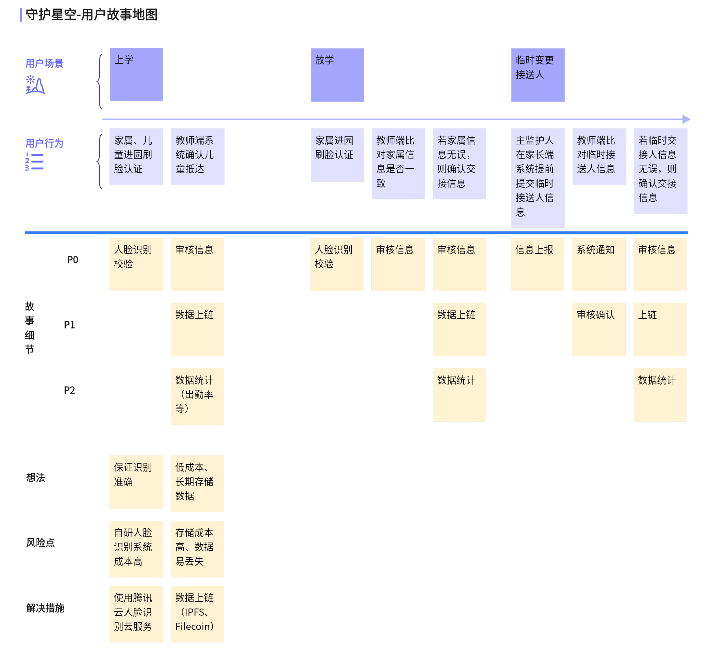

## 介绍
本项目仅主要作为面试作品展示，便于企业方对本人的开发风格与编码技术进行多方位考量，并非完整闭环业务。

## 项目名
守护星空（Star Guard）

## 项目简介
主要应用与幼儿园儿童接送场景，在儿童入园和离园时，对其接送的家属进行必要的人脸识别认证审核，杜绝儿童拐骗的惨案发生。结合区块链相关技术 IPFS 和 Filecoin 对数据进行上链，保证了数据安全性和不可篡改性，一旦类似事件发生，便于公安机关溯源办案。

## 用户故事地图

